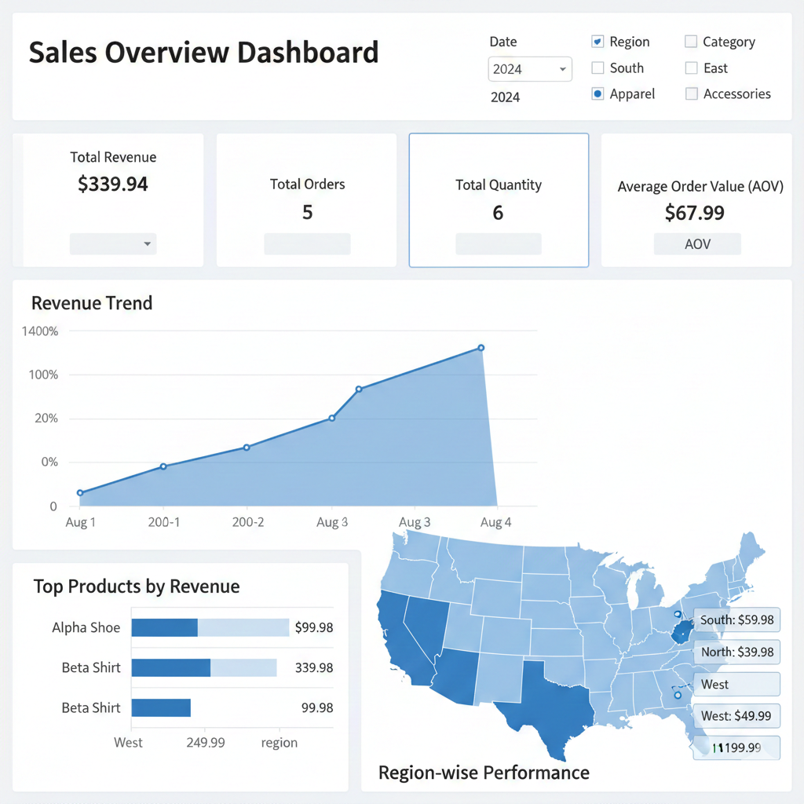

# Sales Dashboard — Sales Analytics & Dashboard


**Project type:** Data Analyst portfolio piece — Power BI dashboard + SQL transformations + Python EDA


## Objective
Build an interactive sales dashboard that answers core business questions: revenue trends, top products, regional performance, repeat-customer behavior, and churn signals. Provide clear recommendations supported by data.


## Tech stack
- Power BI (dashboard .pbix or screenshots)
- SQL (data transformation queries)
- Python (Pandas) for EDA and small data prep


## Repo structure
- `data/sample_sales.csv` — small sample dataset for quick demos
- `sql/queries.sql` — SQL used to transform / aggregate data
- `analysis/EDA.md` — EDA notebook-style steps 
- `powerbi/SalesDashboard.pbix` — Power BI file or `powerbi/screenshots/` for images

## Dashboard Preview




## How to run (local)
1. Clone the repo:
```bash
git clone git@github.com:MisabAbdulRashid/sales-dashboard-analytics.git
cd sales-dashboard-analytics
